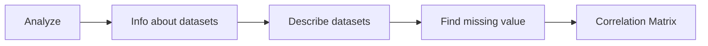

# Simple App to Visualize Excel Data 
Simple data analysis tool with some visualization option using streamlit.
You can upload your onw datasets in this app. However, there is some limitations, you can only upload file which are only 200mb or below 200 mb.  
### File type
This app support .xlsx and .CSV file. 

### Options 
This app has  two analzying option which are following:
- Overall columns
 - Analyze
 - chart type
#### Overall columns
You can check the datasets by droping the whichever columns you want. Also you can sort the column by clicking the columns name in the table 

We can also draw the following plot

